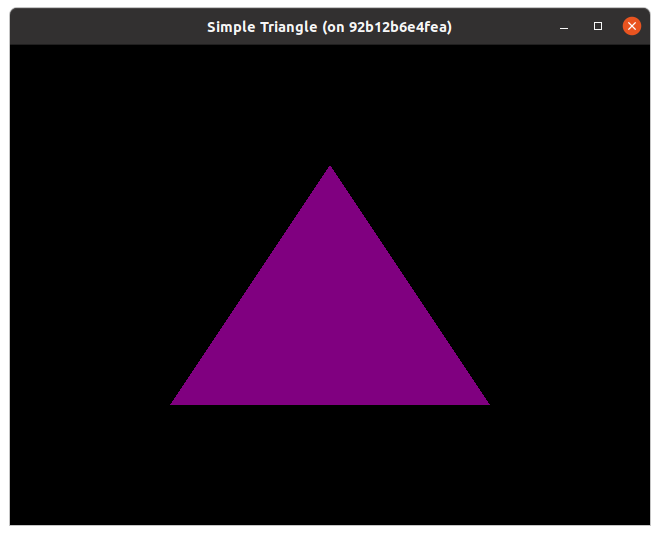

# Simple triangle

## Description

This example provides a minimal code to draw a triangle using simple shaders and vertex buffers.

## Building and launching the example

Run the docker container with

```bash
./run-docker.sh
```

and build the project with

```bash
mkdir build
cd build
cmake ..
make
```

If the project build was successfull,
`SimpleTriangle` application will appear in the `build/` directory.
Launching the application with

```bash
cd build
./SimpleTriangle
```

To launch the application from another directory, update paths to shaders set in
`vertex_shader_path` and `fragment_shader_path` correspondingly, and rebuild the application.

## Result

If you launch the `SimpleTriangle` application, you should see a purple triangle.


